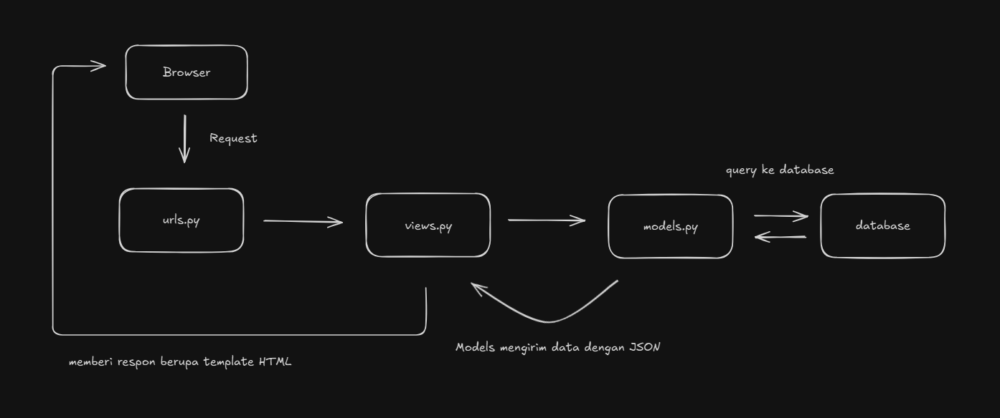
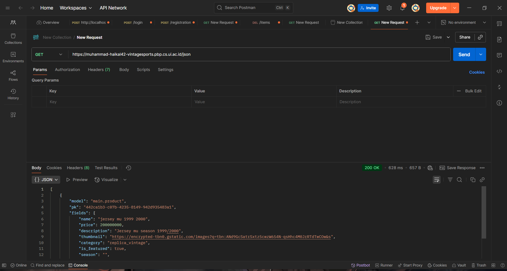
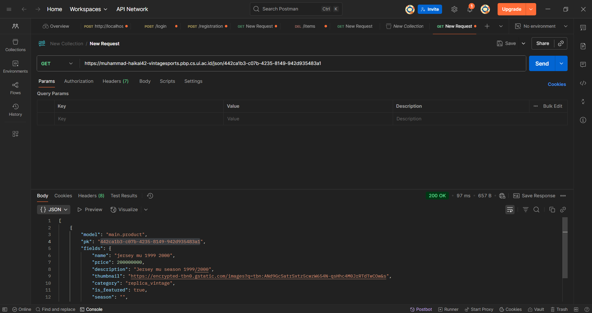
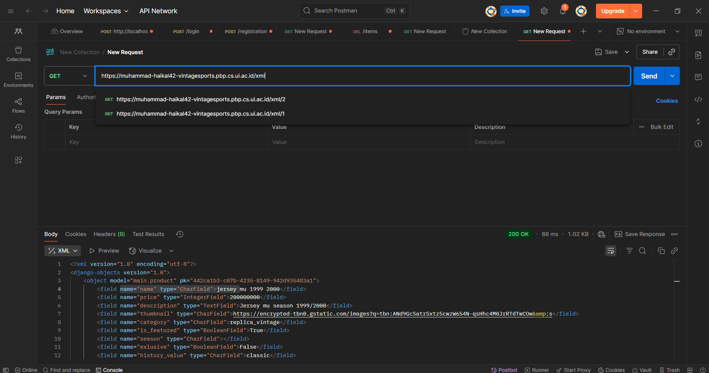
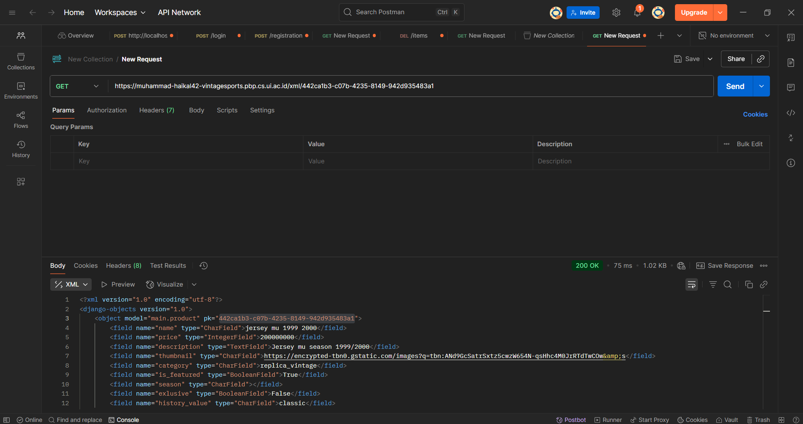
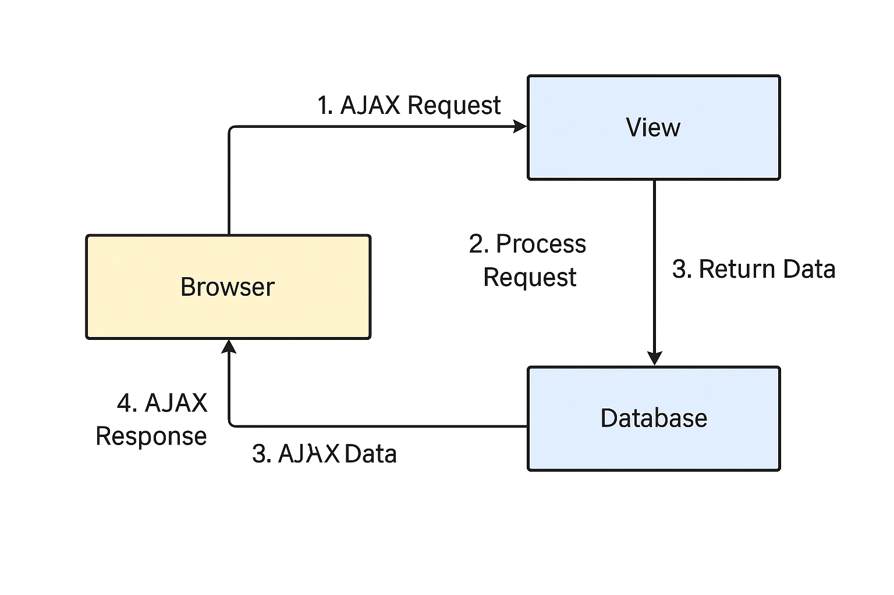

# Vintage Sports (TUGAS INDIVIDU PBP)

## Link Deployment
https://muhammad-haikal42-vintagesports.pbp.cs.ui.ac.id

<details>
    <summary><h2>Tugas Individu 2</h2></summary>

## Jelaskan bagaimana cara kamu mengimplementasikan checklist di atas secara step-by-step (bukan hanya sekadar mengikuti tutorial)
#### 1. Membuat proyek Django baru.

-   Membuat *virtual environment* Python dengan perintah `python -m venv env`, dan mengaktifkannya dengan perintah `env\Scripts\activate`.
-   Membuat file `requirements.txt` 
-   Buat project Django baru dengan perintah `django-admin start project vintage_sports .`

#### 2. Membuat aplikasi *main* pada proyek tersebut.

-   Menjalankan perintah `python manage.py startapp main`.
-   Menambahkan `'main'` ke `INSTALLED_APPS` pada `vintage_sports/settings.py`.
#### 3. Melakukan *routing* ke `main`
-   Menambahkan *modules-modules* di bawah ini pada `vintage_sports/urls.py`
    ```py
    from django.urls import path, include
    ```
-   Menambahkan URL app `main`
    ```py
    path('', include('main.urls'))
    ```


#### 4. Membuat model pada aplikasi `main` dengan nama `Product` 
-   membuat model baru dengan nama `Product` pada `main/models.py` dan tambahkan atribut yang sesuai

#### 5. Membuat sebuah fungsi pada `views.py` untuk dikembalikan ke dalam sebuah *template* HTML.

-   Membuat fungsi `show_index` pada `main/views.py` 
-   Lalu menambahkan atribut-atribut yang dibutuhkan

#### 6. Menambahkan routing pada `urls.py` aplikasi main untuk memetakan fungsi yang telah dibuat pada `views.py`.

-   Membuat file `main/urls.py` dan tambahkan baris-baris di bawah ini:
    ```py
    urlpatterns = [
        path('', show_index, name='index'),
    ]
    ```
#### 7. Melakukan *deployment* di PWS.

-   Membuat projek baru
-   Konfigurasi *environment variables* yang ada di `.env.prod`.
-   Push branch master ke pws

## Buatlah bagan yang berisi request client ke web aplikasi berbasis Django beserta responnya dan jelaskan pada bagan tersebut kaitan antara urls.py, views.py, models.py, dan berkas html.

* **urls.py** berfungsi untuk memeriksa pola URL dan mengarahkan ke fungsi/class di views.py yang sesuai.

* **views.py** berfungsi untuk menangani logika utama pada saat URL dipanggil. View menerima request, berinteraksi dengan models.py untuk mengambil/memanipulasi data (jika diperlukan), lalu mengembalikannya dalam bentuk JSON.
* **models.py** berfungsi untuk mendefinisikan struktur data menggunakan ORM (Object-Relational Mapping) yang nantinya akan dihubungkan dengan database.
* **Berkas HTML** nantinya akan digunakan untuk merender data yang diterima ke broser

## Jelaskan peran settings.py dalam proyek Django!
* Konfigurasi variabel Global seperti DEBUG, SECRET_KEY, ALLOWED_HOST. dll
* Database setup dimana setting.py dapat menentukan jenis database apa yang akan dipakai dan menghubugnkannya dengan projek
* Mengkonfigurasi middleware

## Bagaimana cara kerja migrasi database di Django?
Migrage database di Django dilakukan secara otomatis berdasarkan penerapan perubahan skema model ke datase
+ Pertama2 lakukan perubahan terlebih dahulu pada models.py
+ Jalankan perintah ``python manage.py makemigrations`` dimana fungsi dari perintah ini adalah untuk membuat django memerika perubahan model dari migrasi terakhir lalu mengenerate file di folder migrations
+ Apply migrasi ke database menggunakan perintah ``python manage.py migrate``

## Menurut Anda, dari semua framework yang ada, mengapa framework Django dijadikan permulaan pembelajaran pengembangan perangkat lunak?
* Djago menggunakan bahasa python yang lebih mudah untuk dipelajari pemula dibanding bahasa lain
* Framework Fullstack yang artinya django dapat mengurus frondend dan backend dalam 1 framework sehingga pemula cukup belajar 1 framework saja
* Dokumentasi lengkap dan Komunitas yang besar

## Apakah ada feedback untuk asisten dosen tutorial 1 yang telah kamu kerjakan sebelumnya?
Sejauh ini belum ada, para asdos sudah melakukan tugasnya dengan sangat baik

</details>


<details>
    <summary><h2>Tugas Individu 3</h2></summary>

## Jelaskan mengapa kita memerlukan data delivery dalam pengimplementasian sebuah platform?
Data delivery sangat penting dalam pengembangan sebuah platform karena hal ini merupakan mekanisme utama dalam pertukaran data antara client dan server, misalnya saat aplikasi web atau mobile membutuhkan data seperti data produk, berita, atau pesan dari server dan sebaliknya server menerima input dari pengguna seperti form, komentar, atau transaksi. Dengan adanya data delivery, komunikasi antar sistem dapat berlangsung secara konsisten dan efisien, serta memungkinkan interoperabilitas antara aplikasi yang dibangun dengan bahasa pemrograman berbeda karena data dikirim dengan format standar. Selain itu, data delivery juga memastikan keamanan karena memungkinkan adanya validasi, enkripsi, serta perlindungan terhadap serangan yang mungkin terjadi selama proses pertukaran data.

## Menurutmu, mana yang lebih baik antara XML dan JSON? Mengapa JSON lebih populer dibandingkan XML?
Menurut saya JSON lebih baik dibanding XML ini dikarenakan JSON (JavaScript Object Notation) jauh lebih sederhana, ringkas, mudah dibaca manusia, dan langsung dapat dipetakan ke struktur data di berbagai bahasa pemrograman modern. Lalu JSON lebih populer dibanding XML karena lebih hemat bandwidth, lebih cepat diproses dan sintaksnya lebih ringan sehingga JSON menjadi pilihan utama dalam hampir semua API modern.

## Jelaskan fungsi dari method is_valid() pada form Django dan mengapa kita membutuhkan method tersebut?
Method is_valid() pada form Django berfungsi untuk melakukan validasi terhadap data yang diinput pengguna sebelum data tersebut digunakan atau disimpan ke dalam database. is_valid() sangat penting sebab dengan adanya is_valid(), developer bisa mencegah masuknya data yang salah atau berbahaya ke database sehingga menjaga integritas dan keamanan aplikasi.

## Mengapa kita membutuhkan csrf_token saat membuat form di Django? Apa yang dapat terjadi jika kita tidak menambahkan csrf_token pada form Django? Bagaimana hal tersebut dapat dimanfaatkan oleh penyerang?
csrf_token pada form Django sangat penting untuk melindungi aplikasi dari serangan CSRF (Cross-Site Request Forgery), yaitu serangan di mana penyerang memanfaatkan sesi login aktif seorang pengguna untuk mengirim request palsu tanpa sepengetahuan korban. csrf_token sendiri berfungsi sebagai token unik yang harus dikirim bersama setiap request POST sehingga server dapat memastikan bahwa request tersebut benar-benar berasal dari form sah di aplikasi itu sendiri. Jika csrf_token tidak ditambahkan maka penyerang dapat dengan mudah membuat form tiruan untuk memaksa browser korban mengirim request.

## Jelaskan bagaimana cara kamu mengimplementasikan checklist di atas secara step-by-step (bukan hanya sekadar mengikuti tutorial).
### 1. Menambah beberap atribut baru pada `models.py`
```py
CATEGORY_CHOICES = [
        ('match_worn_vintage', 'Match Worn Vintage'),
        ('player_issue_vintage', 'Player Issue Vintage'),
        ('replica_vintage', 'Replica Vintage'),
        ('reissue_retro', 'Reissue Retro'),
        ('special_edition_vintage', 'Special Edition Vintage'),
        ('analysis', 'Analysis'),
    ]

    history_value_choices = [
        ('classic', 'Classic'),
        ('signed_vintage', 'Signed Vintage'),
        ('limited_edition', 'Limited Edition'),
        ('historical_matches', 'Historical Matches')
    ]

    history_value = models.CharField(max_length=50,choices=history_value_choices, default='classic')
```

### 2. Membuat forms.py untuk kerangka dalam form

### 3. Membuat fungsi baru pada `views.py` untuk mengatur logika pada form product
- `create_product`
    ```py
    def create_product(request):
        form = ProductForm(request.POST or None)

        if form.is_valid() and request.method == "POST":
            form.save()
            return redirect('main:show_main')

        context = {'form': form}
        return render(request, "create_product.html", context)
    ```
- `show_product`
    ```py
    def show_product(request, id):
        product = get_object_or_404(Product, pk=id)

        context = {
            'product': product
        }

        return render(request, "product_detail.html", context)
    ```

### 4. Membuat template html
- Pertama2 saya membuat base.html pada folder templates pada root sebagai header pada setiap file html
- Mengatur konfigurasi template file pada `settings.py` dengan menambah kode ini 
    ```py
    TEMPLATES = [
        {
            ...
            'DIRS': [BASE_DIR / 'templates'], 
            ...
        }
    ]
    ```
- Lalu membuat `create_product.html` dan `product_detail.html` sebagai UI pada pages create product dan product_detail
- Melakukan sedikit perubahan pada `main.html`

### 5. Membuat fungsi baru pada `views.py` untuk mengatur data delivery
- show_xml 
    ```py
    def show_xml(request):
        news_list = Product.objects.all()
        xml_data = serializers.serialize("xml", news_list)
        return HttpResponse(xml_data, content_type="application/xml")
    ```
- show_json
     ```py
    def show_json(request):
        news_list = Product.objects.all()
        json_data = serializers.serialize("json", news_list)
        return HttpResponse(json_data, content_type="application/json")
    ```
- show_xml_by_id
    ```py
    def show_xml_by_id(request, news_id):
        try:
            news_item = Product.objects.filter(pk=news_id)
            xml_data = serializers.serialize("xml", news_item)
            return HttpResponse(xml_data, content_type="application/xml")
        except Product.DoesNotExist:
            return HttpResponse(status=404)
    ```
- show_json_by_id
     ```py
    def show_json_by_id(request, news_id):
        try:
            news_item = Product.objects.get(pk=news_id)
            json_data = serializers.serialize("json", [news_item])
            return HttpResponse(json_data, content_type="application/json")
        except Product.DoesNotExist:
            return HttpResponse(status=404)
    ```

### 6. membuat routing baru pada `urls.py`
```py
urlpatterns = [
    path('', show_main, name='show_main'),
    path('create-news/', create_product, name='create_product'),
    path('news/<str:id>/', show_product, name='show_product'),
    path('xml/', show_xml, name='show_xml'),  
    path('json/', show_json, name='show_json'),
    path('xml/<str:news_id>/', show_xml_by_id, name='show_xml_by_id'),
    path('json/<str:news_id>/', show_json_by_id, name='show_json_by_id')
    ]
```

### 7. Menambah konfigurasi csrf token pada `settings.py`
- Menambah kode ini pada ```settings.py```
    ```py
    CSRF_TRUSTED_ORIGINS = [
        "https://muhammad-haikal42-vintagesports.pbp.cs.ui.ac.id"
    ]
    ```
- Ini dilakukan agar tidak terjadi csrf pada aplikasi


## Apakah ada feedback untuk asisten dosen tutorial 2 yang telah kamu kerjakan sebelumnya?
Sejauh ini belum ada, para asdos sudah melakukan tugasnya dengan sangat baik

## Hasil Postman
- /json

- /json/:id

- /xml

- /xml/:id


</details>

<details>
    <summary><h2>Tugas Individu 4</h2></summary>

## Apa itu Django AuthenticationForm? Jelaskan juga kelebihan dan kekurangannya.
Merupakan form bawaan yang disediakan oleh django untuk menangani autentifikasi pengguna, kelebihannya mudah dipakai, aman karena terhubung ke sistem hashing password, dan langsung kompatibel dengan model User, sedangkan kekurangannya kurang fleksibel jika aplikasi butuh form login yang sangat kustom.

## Apa perbedaan antara autentikasi dan otorisasi? Bagaiamana Django mengimplementasikan kedua konsep tersebut?
Autentifikasi merupaakn suatu proses memastikan identitas pengguna(misalnya dalam login dengan menggunakna username dan password), sedangkan otorisasi menentukan hak akses pengguna setelah berhasil diautentikasi. Lalu Django mengimplementasikan autentifikasi dan otorisasi melalui **django.contrib.auth** dengan fitur login, register, dan validasi, sedangkankan otorisasi melalui fitur seperti permissions, groups, dan decorator

## Apa saja kelebihan dan kekurangan session dan cookies dalam konteks menyimpan state di aplikasi web?
Session dan cookies sama-sama digunakan untuk menyimpan state di aplikasi web, namun memiliki kelebihan dan kekurangan masing-masing. Cookies disimpan di sisi klien, sehingga mudah diakses antar request tanpa beban server, tetapi lebih rentan terhadap manipulasi dan memiliki keterbatasan ukuran. Session disimpan di sisi server dan biasanya hanya menyimpan ID di browser (via cookie), sehingga lebih aman untuk data sensitif dan bisa menampung lebih banyak informasi, namun membebani server karena harus menyimpan data untuk setiap pengguna. Dengan kata lain, cookies lebih ringan tapi kurang aman, sedangkan session lebih aman dan fleksibel tetapi membutuhkan resource server lebih besar.


## Apakah penggunaan cookies aman secara default dalam pengembangan web, atau apakah ada risiko potensial yang harus diwaspadai? Bagaimana Django menangani hal tersebut?
Cookies tidak otomatis aman karena rawan dicuri atau dimanipulasi lewat serangan seperti XSS dan session hijacking, sehingga perlu perlindungan ekstra seperti HttpOnly, Secure, dan SameSite. Django secara default sudah cukup aman karena hanya menyimpan session ID di cookie, sementara data sesungguhnya ada di server, serta menandatangani cookie agar tidak bisa diubah sembarangan. Selain itu, Django mengaktifkan SESSION_COOKIE_HTTPONLY = True secara default untuk mencegah akses dari JavaScript, dan developer dianjurkan menambahkan SESSION_COOKIE_SECURE = True serta konfigurasi SameSite untuk mencegah kebocoran data melalui HTTP atau cross-site request.

## Jelaskan bagaimana cara kamu mengimplementasikan checklist di atas secara step-by-step (bukan hanya sekadar mengikuti tutorial).

### 1. Mengimplemntasi fungsi login, register dan logout


-   Implementasikan fungsi `register`, `login_user` dan `logout_user` pada `main/views.py`
    ```py
    def register(request):
    form = UserCreationForm()

    if request.method == 'POST':
        form = UserCreationForm(request.POST)
        if form.is_valid():
            form.save()
            messages.success(request, 'Account successfully created!')
            return redirect('main:login')
    context = {'form': form}
    return render(request, 'register.html', context)

    def login_user(request):
        if request.method == 'POST':
            form = AuthenticationForm(data=request.POST)

            if form.is_valid():
                user = form.get_user()
                login(request, user)
                response = HttpResponseRedirect(reverse('main:index'))
                return response
        else:
            form = AuthenticationForm(request)
        context = {'form': form}
        return render(request, 'login.html', context)

    def logout_user(request):
        logout(request)
        response = HttpResponseRedirect(reverse('main:login'))
        return response
    ```

-   Import decorator `login_requeired` dari `django.contrib.auth.decorators`
    ```py
    from django.contrib.auth.decorators import login_required
    ```

-   Menambah decorator `@login_required(login_url='/login')` pada page yg butuh login.

-   Decorator `login_required` memastikan user untuk login terlebih dahulu untuk setiap fungsi-fungsi views tersebut.

-   Jangan lupa untuk menambahkan template untuk login dan register.

### 2. Menghubungkan model Product dengan User.

-   Pada `main/models.py`, import class `User` dari `django.contrib.auth.models`
    ```py
    from django.contrib.auth.models import User
    ```
-   Menghubungkan user dengan product
    ```py
    user = models.ForeignKey(User, on_delete=models.CASCADE, null=True)
    ```
    
-   Lakukan migrate dengan `python manage.py makemigrations` dan `pyhton manage.py migrate`


### 3. Menampilkan detail informasi pengguna yang sedang logged in seperti username dan menerapkan cookies seperti last_login pada halaman utama aplikasi.
-   Pada `main/views.py`, menambahkan baris untuk set cookie
    ```py
    response.set_cookie('last_login', str(datetime.datetime.now()))
    ```

-   Tambahkan baris untuk menhapus cookie saat logout
    ```py
    response.delete_cookie('last_login')
    ```
    
-   Menambahkan informasi tentang sesi terakhir login di `main/templates/main.html`:
    ```html
    <div class="pill">
        <span> Last login session: {{ last_login }}</span>
    </div>
    ```

</details>

<details>
    <summary><h2>Tugas Individu 5</h2></summary>

## Jika terdapat beberapa CSS selector untuk suatu elemen HTML, jelaskan urutan prioritas pengambilan CSS selector tersebut!
Jika terdapat beberapa CSS selector yang berlaku pada elemen HTML yang sama, maka browser akan menentukan gaya mana yang dipakai berdasarkan specificity (tingkat kekhususan) dan urutan deklarasi. Prioritasnya dimulai dari inline style (paling tinggi), kemudian selector dengan ID, lalu class/atribut/pseudo-class, dan terakhir selector elemen/tag/pseudo-element. Jika dua aturan memiliki tingkat specificity yang sama, maka aturan yang dideklarasikan terakhir di file CSS akan digunakan. Selain itu, aturan dengan !important akan mengesampingkan semua aturan lain, kecuali jika ada beberapa !important dengan specificity berbeda, maka kembali ke urutan prioritas specificity.

## Mengapa responsive design menjadi konsep yang penting dalam pengembangan aplikasi web? Berikan contoh aplikasi yang sudah dan belum menerapkan responsive design, serta jelaskan mengapa!
Responsive design menjadi konsep penting dalam pengembangan aplikasi web karena pengguna saat ini mengakses internet melalui berbagai perangkat dengan ukuran layar yang berbeda—mulai dari smartphone, tablet, laptop, hingga monitor besar. Dengan responsive design, tampilan dan elemen web secara otomatis menyesuaikan ukuran layar sehingga tetap nyaman digunakan, mudah dibaca, dan tidak membuat pengguna harus melakukan zoom atau scroll berlebihan. Misalnya, Twitter dan Tokopedia sudah menerapkan responsive design dengan baik: di smartphone menu navigasi otomatis berubah menjadi ikon sederhana (hamburger menu), konten menyesuaikan lebar layar, dan elemen grid berpindah posisi agar tetap rapi. Sebaliknya, beberapa website lama instansi pemerintahan sering belum responsive: ketika dibuka di ponsel, teks terlalu kecil, tabel melebar keluar layar, dan tombol sulit ditekan. Hal ini membuat pengalaman pengguna buruk dan dapat menurunkan engagement, sehingga responsive design bukan hanya estetika, tetapi juga kebutuhan fungsional untuk memastikan aksesibilitas dan kenyamanan di semua perangkat.

## Jelaskan perbedaan antara margin, border, dan padding, serta cara untuk mengimplementasikan ketiga hal tersebut!
- Margin : adalah jarak di luar border elemen, yaitu ruang antara elemen dengan elemen lainnya
    ```css
    div {
    margin: 20px; 
    }=
    ```
- Border : adalah garis di antara margin dan padding, yang mengelilingi konten elemen
    ```css
    div {
    border: 2px solid black; 
    }
    ```
- Padding : adalah jarak di dalam border, yaitu ruang antara konten elemen (teks/gambar) dengan border
    ```css
    div {
    padding: 15px; 
    }
    ```
## Jelaskan konsep flex box dan grid layout beserta kegunaannya!
- **Flexbox** adalah sistem layout CSS satu dimensi yang berfungsi untuk mengatur elemen secara fleksibel dalam satu arah, baik horizontal (row) maupun vertikal (column). Dengan flexbox, developer dapat dengan mudah mengatur posisi, perataan, dan jarak antar elemen tanpa perlu menggunakan banyak perhitungan manual, sehingga sangat efektif digunakan untuk membuat komponen seperti navbar, daftar tombol, card produk, atau form agar tetap rapi dan responsif di berbagai ukuran layar.
- **Grid** Layout adalah sistem layout CSS dua dimensi yang memungkinkan pengaturan elemen dalam bentuk baris (rows) dan kolom (columns) sekaligus, sehingga memberikan kontrol penuh untuk membagi area halaman menjadi struktur yang kompleks. Grid sangat berguna untuk membangun layout halaman secara keseluruhan, seperti header, sidebar, konten utama, dan footer, atau galeri gambar yang tersusun rapi, karena dapat mendefinisikan ukuran, jarak, dan proporsi elemen dengan lebih terstruktur dan konsisten.
## Jelaskan bagaimana cara kamu mengimplementasikan checklist di atas secara step-by-step (bukan hanya sekadar mengikuti tutorial)!

### 1. Menambahkan fitur edit product
```python
def edit_product(request, id):
    product = get_object_or_404(News, pk=id)
    form = ProductForm(request.POST or None, instance=news)
    if form.is_valid() and request.method == 'POST':
        form.save()
        return redirect('main:show_main')

    context = {
        'form': form
    }

    return render(request, "edit_product.html", context)
```

### 2. Menambahkan fitur hapus product
```python
def delete_product(request, id):
    product = get_object_or_404(News, pk=id)
    product.delete()
    return HttpResponseRedirect(reverse('main:show_main'))
```

### 3. Melakukan styling pada html
- Pertama menyambungkan tailwind melalu script CDN pada base.html
    ```html
    <script src="https://cdn.tailwindcss.com">
    </script>
    ```
- Update middleware agar dapat serve static file
    ```python
    MIDDLEWARE = [
    'whitenoise.middleware.WhiteNoiseMiddleware', 
    ]
    ```
- Melakukan styling pada seluruh template html
</details>

<details>
    <summary><h2>Tugas Individu 6</h2></summary>

## Apa perbedaan antara synchronous request dan asynchronous request?
Perbedaan antara synchronous dan asynchronous request terletak pada cara JavaScript mengeksekusi prosesnya. Pada synchronous request, program akan menunggu satu tugas selesai terlebih dahulu sebelum melanjutkan ke baris berikutnya, sehingga dapat menyebabkan aplikasi terhenti sementara (blocking) jika prosesnya lama. Sebaliknya, pada asynchronous request, program tidak menunggu hasil dari tugas tersebut; JavaScript akan melanjutkan eksekusi kode lain sambil menunggu hasil proses di latar belakang, dan ketika hasilnya siap, barulah fungsi callback atau promise dijalankan. Pendekatan asynchronous ini membuat aplikasi tetap responsif dan cepat, terutama saat menangani operasi jaringan seperti memanggil API.
- Sycnronous
    ```javascript
    function getDataSync() {
        const xhr = new XMLHttpRequest();
        xhr.open("GET", "https://jsonplaceholder.typicode.com/posts/1", false); 
        xhr.send(); 
        console.log(xhr.responseText);
    }
    ```
- Asynchronous
    ```javascript
    fetch("https://jsonplaceholder.typicode.com/posts/1")
    .then(response => response.json())
    .then(data => console.log(data))
    .catch(err => console.error(err));
    ```
## Bagaimana AJAX bekerja di Django (alur request–response)?

Dalam konteks Django, AJAX (Asynchronous JavaScript and XML) bekerja dengan cara memungkinkan browser mengirim dan menerima data dari server tanpa me-refresh halaman secara penuh. Alur kerjanya adalah: ketika pengguna melakukan aksi di halaman (misalnya klik tombol), JavaScript akan membuat request asinkron (biasanya dengan fetch() atau **$.ajax()**) ke URL Django tertentu (misalnya ke view bernama **/get-data/**). Django kemudian menerima request ini seperti request biasa, memprosesnya di views.py (misalnya mengambil data dari database), lalu mengembalikan response dalam format JSON. JavaScript di sisi klien akan menerima data JSON itu, dan menggunakan hasilnya untuk memperbarui bagian tertentu dari halaman (DOM) tanpa melakukan reload seluruh halaman. Dengan cara ini, interaksi pengguna terasa lebih cepat dan dinamis, karena hanya sebagian kecil halaman yang diperbarui.
## Apa keuntungan menggunakan AJAX dibandingkan render biasa di Django?
- Tidak perlu reload seluruh halaman
- Respons lebih cepat dan hemat bandwidth
- Pengalaman pengguna (UX) lebih interaktif
- Pemisahan logika data dan tampilan
## Bagaimana cara memastikan keamanan saat menggunakan AJAX untuk fitur Login dan Register di Django?
- Menggunakan HTTPS untuk mencegah man-in-the-middle attack
- Menggunakan CSRF token saat melakukan request
- Menambahkan validasi input pada sisi server (bukan hanya di client side saja)
- Menggunakan response JSON, bukan HTML render
## Bagaimana AJAX mempengaruhi pengalaman pengguna (User Experience) pada website?
AJAX sangat meningkatkan User Experience (UX) pada website karena membuat interaksi terasa cepat, dinamis, dan responsif tanpa perlu me-refresh seluruh halaman. Dengan AJAX, hanya bagian tertentu dari halaman yang diperbarui ketika pengguna melakukan suatu aksi, misalnya mengirim form, menambah data, atau memuat komentar baru. Hal ini mengurangi waktu tunggu dan konsumsi data, sehingga pengguna tidak kehilangan konteks atau gangguan visual akibat reload penuh. Selain itu, AJAX memungkinkan tampilan yang lebih interaktif dan real-time, seperti notifikasi langsung, live search, dan auto-save, yang membuat pengalaman pengguna terasa lebih halus, efisien, dan modern.

</details>